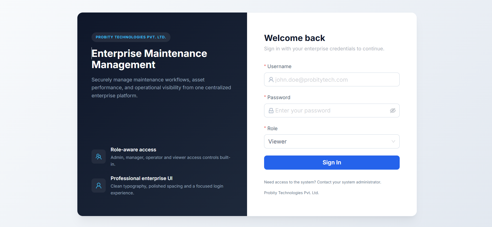
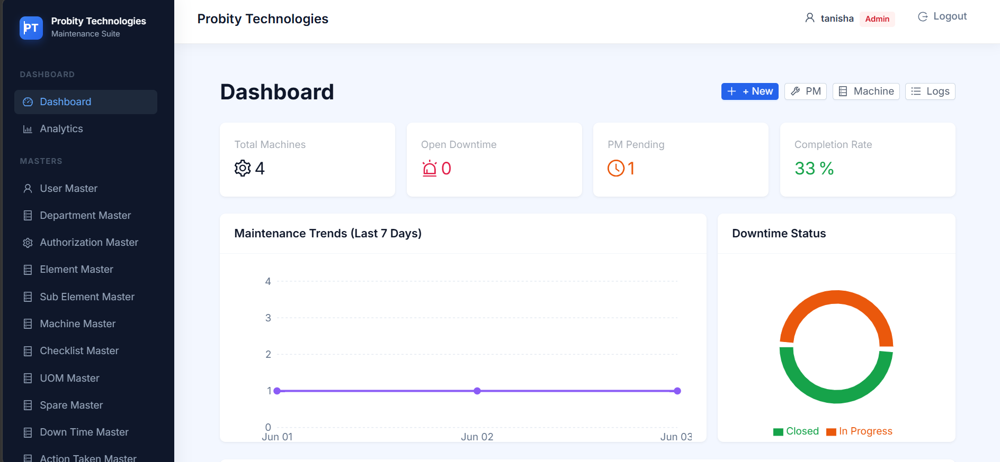
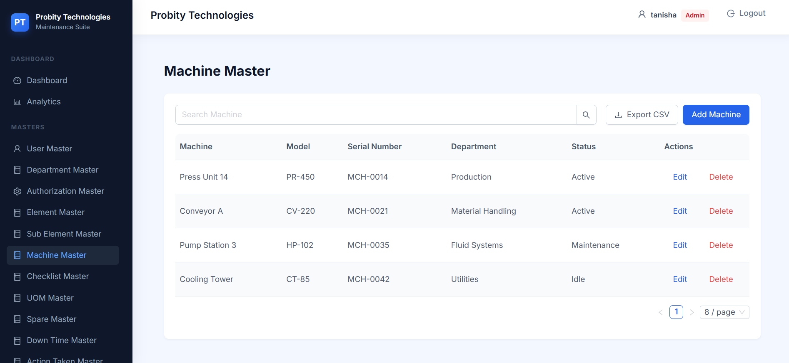
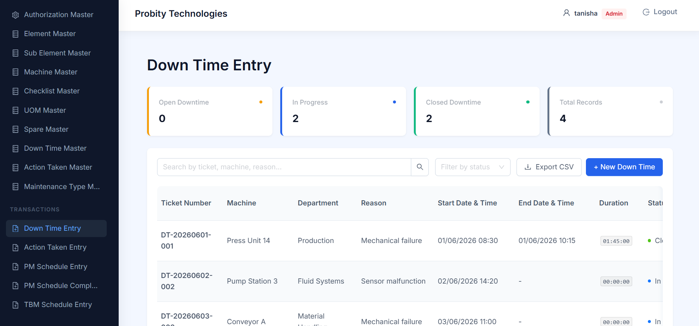
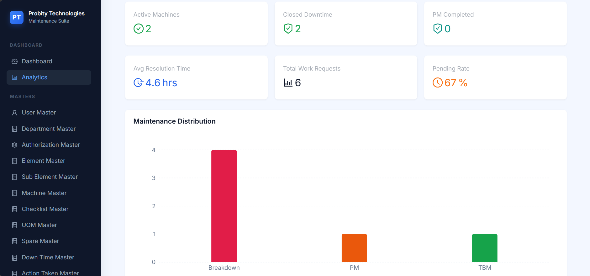

# Enterprise Maintenance Management System (EMMS)

An Enterprise Maintenance Management System (EMMS) developed during my **Web Development Internship at Probity Technologies Pvt. Ltd.** to digitize and streamline maintenance operations in manufacturing environments.

The application centralizes maintenance activities including machine downtime tracking, preventive maintenance scheduling, corrective action management, and real-time maintenance monitoring through an interactive dashboard.

---

##  Project Highlights

- 🔐 Role-Based Authentication
- 🏭 Machine & Department Management
- 🛠️ Downtime Tracking
- 📋 Preventive Maintenance (PM)
- ⚙️ TBM Management
- 📊 Interactive Dashboard & Analytics
- 📁 CRUD Operations
- 💾 Local Storage Persistence
- 📱 Responsive Enterprise UI
- ⚡ Built with React + TypeScript + Ant Design

---

# Problem Statement

Manufacturing industries require an efficient system to monitor machine maintenance activities and minimize equipment downtime.

Traditional maintenance tracking through spreadsheets and manual records often leads to:

- Difficulty tracking machine downtime history
- Delayed maintenance updates
- Lack of centralized maintenance information
- Poor visibility of pending maintenance activities
- Inefficient maintenance planning

The Enterprise Maintenance Management System addresses these challenges by providing a centralized digital platform for maintenance planning, execution, monitoring, and reporting.

---

# Features

## Master Management

- User Management
- Role & Authorization Management
- Machine Master
- Department Master
- Checklist Management
- Spare Parts Management
- Element Management
- Sub Element Management
- Unit of Measurement (UOM)
- Downtime & Action Configuration

---

## Transaction Modules

### Downtime Entry

- Create downtime records
- Track affected machines
- Manage downtime lifecycle
- Monitor maintenance status

### Action Taken

- Record corrective actions
- Link actions with downtime records
- Track maintenance completion

### Preventive Maintenance (PM)

- Schedule preventive maintenance
- Track maintenance completion
- Monitor pending schedules

### TBM Management

- Schedule TBM activities
- Record execution details
- Track completion status

---

## Dashboard & Analytics

- Total Machines
- Open Downtime
- Closed Downtime
- Pending Maintenance
- Dashboard KPI Cards
- Maintenance Analytics
- Recent Activities
- Responsive Dashboard Layout

---

## Authentication & Authorization

- Secure Login
- Role-Based Access Control
- Protected Routes
- Permission-Based UI
- Logout Functionality

---

## Data Persistence

The application uses Local Storage persistence to retain data between sessions.

Supports persistence for:

- Master Records
- Downtime Records
- Action Taken Records
- PM Schedules
- TBM Schedules
- Authentication State

---

# Maintenance Workflow

```text
Machine Issue Detected
          │
          ▼
Downtime Entry Created
          │
          ▼
Action Taken Recorded
          │
          ▼
Maintenance Completed
          │
          ▼
Issue Closed
          │
          ▼
Dashboard & Analytics
```

---

# Technology Stack

| Category | Technology |
|-----------|------------|
| Frontend | React.js |
| Language | TypeScript |
| UI Framework | Ant Design |
| Routing | React Router |
| State Management | Context API |
| Data Storage | Local Storage |
| Build Tool | Vite |
| Styling | CSS |
| Version Control | Git & GitHub |

---

# Architecture Overview

```text
                 User

                   │

                   ▼

            React Application

                   │

         Context API State Management

                   │

        Local Storage Persistence

                   │

 Dashboard • Masters • Transactions
```

---

# Project Structure

```text
src/
│
├── components/
│   ├── Sidebar
│   ├── Header
│   ├── CRUD Components
│   └── Reusable UI Components
│
├── context/
│   ├── AuthContext
│   └── DataContext
│
├── pages/
│   ├── Dashboard
│   ├── Analytics
│   ├── Masters
│   └── Transactions
│
├── utils/
│   └── Helper & Persistence Utilities
│
├── App.tsx
└── main.tsx
```

---

# Screenshots

## Login



---

## Dashboard



---

## Machine Master



---

## Downtime Entry



---

## Analytics



---

# Installation

Clone the repository

```bash
git clone https://github.com/tanishapatil971/maintenance-management-system.git
```

Navigate to the project

```bash
cd maintenance-management-system
```

Install dependencies

```bash
npm install
```

Run the development server

```bash
npm run dev
```

Build the application

```bash
npm run build
```

---

# Key Features

- Enterprise UI using Ant Design
- Modular Component Architecture
- Role-Based Authentication
- Dashboard Analytics
- CRUD Operations
- Persistent Data Storage
- Responsive Design
- Reusable Components
- Context API State Management

---

# Project Status

✅ Requirement Analysis

✅ Application Architecture

✅ Master Module Development

✅ Maintenance Workflow Implementation

✅ Role-Based Authentication

✅ Dashboard Development

✅ Analytics Dashboard

✅ Local Storage Persistence

✅ UI/UX Refinement

✅ Testing & Optimization

---

# Future Enhancements

- REST API Integration
- SQL Database Integration
- Predictive Maintenance using AI/ML
- Email Notifications
- Advanced Maintenance Reports
- Asset Lifecycle Analytics
- Cloud Deployment
- Multi-Plant Management

---

# Developer

**Tanisha Patil**

B.Tech – Artificial Intelligence & Machine Learning

**GitHub**

https://github.com/tanishapatil971

**Internship**

Probity Technologies Pvt. Ltd.

---

## ⭐ If you found this project useful, consider giving it a Star.
